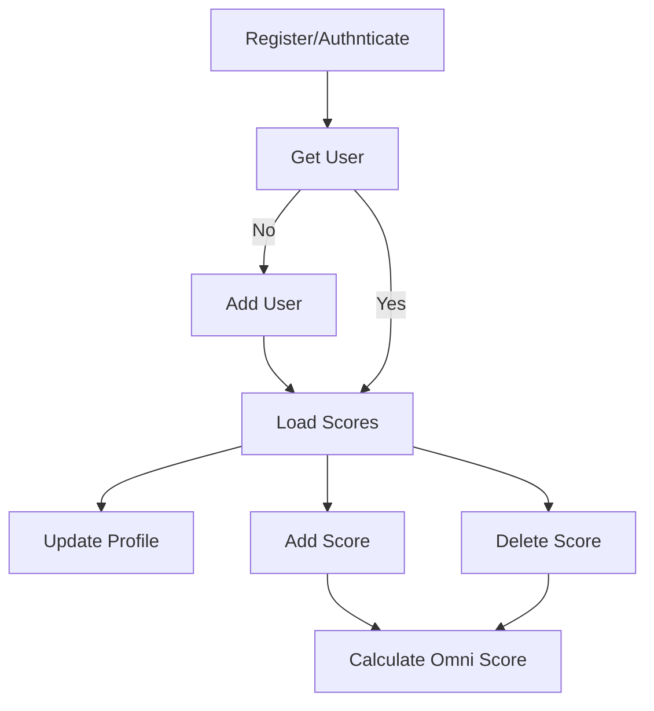
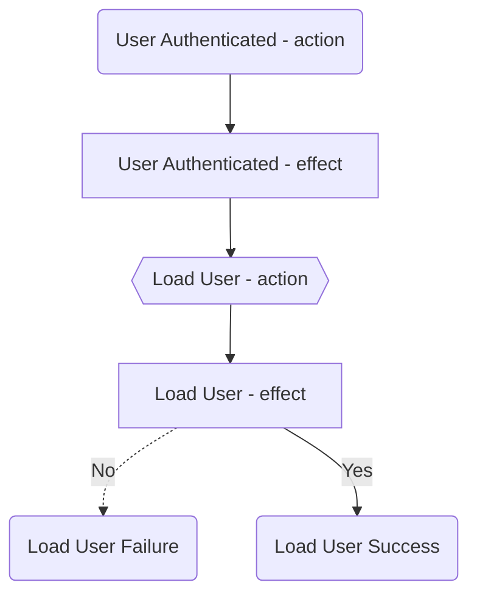

# State Management

Using NgRx

## Actions

### User Actions

- userAuthenticatd
- logoutAction
- loadUserAction
- loadUserSuccess
- loadUserFailure
- newUser
- newUserSuccess
- newUserFailure
- registerUserSuccess
- registerUserFailure
- updateUserAction
- deleteUserScore
- saveNewScore
- saveNewScoreSuccess
- deleteAssessmentScore
- deleteAssessmentScoreSuccess

## Effects

### User Effects

- userRegistered$

    triggered by registerUserSuccess

- userAuthenticated$

    triggered by userAuthenticated, calls the loadUserAction

- loadUser$
- newUser$
- newUserSuccessEffect
- loadScoresEffect
- saveScoreEffect

    result of saveNewScore action calls user service saveScoreToDb then triggeres saveNewScoreSuccess and OmniScore action calculateOmniScore

- deleteScoreEffect

    triggered by deleteAssessmentScore action, calls user service deleteScreFromDb and triggers deleteAssessmentScoreSuccess action and OmniScore calculateOmniScore

### OmniScore Effects

- calculateOmniScore$

    triggered by calculateOmniScore action

- loadUser$

    triggered by setCategoryScore, this currently doesn't seem to have any affect

---

Using diagram to workout combination of SSO with registration.

