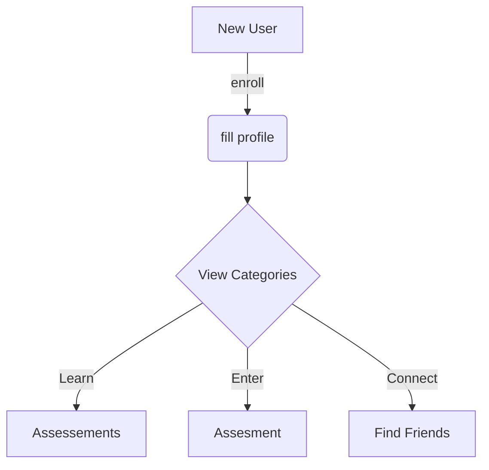

built with
- Angular https://angular.io/
- Capactor
-- https://capacitorjs.com/
-- https://capacitorjs.com/solution/angular
- Ionic

need to install 
- node
- xcode
- cocoapods
- capacitor
  npm i -g @ionic/cli

to build locally 
1. clone repo
2. run npm install
3. ionic serve

#Setting up google authentication
https://developers.google.com/identity/gsi/web/guides/client-library

https://console.cloud.google.com/apis/dashboard

Add to index.html

Then add typescript types
npm install @types/gapi.auth2

addtypes to tsconfig.app.json

  "compilerOptions": {
    "outDir": "./out-tsc/app",
    "types": ["gapi", "gapi.auth2"]
  },

## Try a diagram

setup App Icon for capacitor
1 install cordova-res
npm install -g cordova-res
2 create files
- resources/icon.png
- resources/splash.png
3 