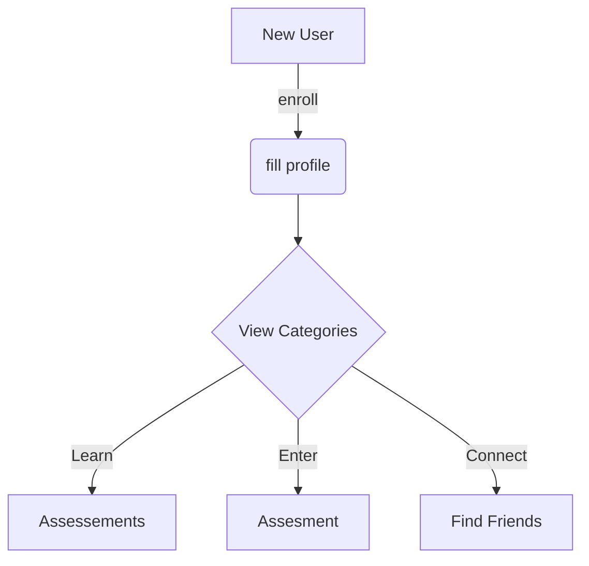

# Omni Method

## built with

- Angular <https://angular.io/>
- Capactor
  -- <https://capacitorjs.com/>
  -- <https://capacitorjs.com/solution/angular>
- Ionic

need to install

- node
- xcode
- cocoapods
- capacitor
  npm i -g @ionic/cli

to build locally

1. clone repo
2. run npm install
3. ionic serve

## Using NgRx

helpful article <https://www.concretepage.com/ngrx/ngrx-effects-example>
<https://eliteionic.com/tutorials/using-ngrx-for-state-management-in-an-ionic-angular-application/>

### App State

```json
{
  "Auth": {
    "email": "fake@email.com",
    "emailValidate": true,
    "uid": "123",
  },
  "User": {
    "uid": "123",
    "email": "test@email.com",
    "firstName": "John",
    "lastName": "Doe",
    "nickName": "Jake",
    "dob": "2007-08-30",
    "weight": 129,
  },
  "scores": [
    {
      "calculatedScore":360,
      "notes":"",
      "scoreDate":"1/16/2023",
      "aid":"BNCH",
      "rawScore":216,
      "uid":"anJJeMDX6RTHDNOCPpPIxOObLy92",
    }
  ],
  "Assessments": [
    {
      "max":70,
      "min":20,
      "icon":"/assets/images/Agility.jpg",
      "label":"Agility",
      "aid":"AGLTY",
      "cid":"NEUR",
      "description":"Must touch cone with hand. Order of cones must be followed. Feet cannot cross during the left and right cones."
    },
  ],
  "Categories": [],
}
```

### Actions

- new user
- new score

## Setting up google authentication

<https://developers.google.com/identity/gsi/web/guides/client-library>

<https://console.cloud.google.com/apis/dashboard>

Add to index.html

```html
<script src="https://accounts.google.com/gsi/client" async defer></script>
```

Then add typescript types
npm install @types/gapi.auth2

addtypes to tsconfig.app.json

"compilerOptions": {
"outDir": "./out-tsc/app",
"types": ["gapi", "gapi.auth2"]
},

## Try a diagram



setup App Icon for capacitor
1 install cordova-res
npm install -g cordova-res
2 create files

- resources/icon.png
- resources/splash.png
  3

Firebase
omni-login user
<https://console.firebase.google.com/project/omni-login-63e9f/authentication/users>
