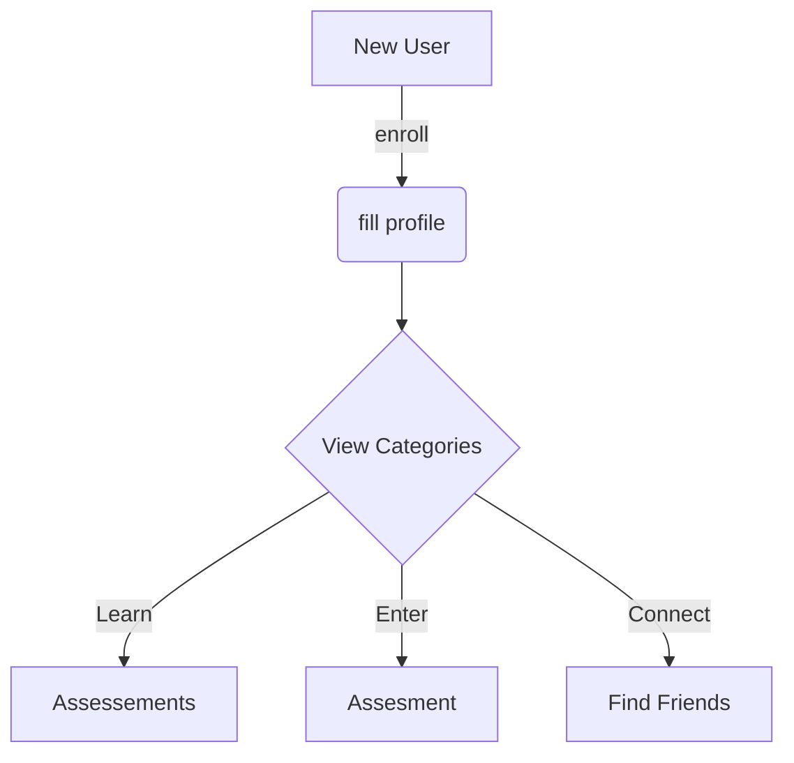

# Omni Method

## built with

- Angular <https://angular.io/>
- Capacitor <https://capacitorjs.com/>
- Capacitor Angular <https://capacitorjs.com/solution/angular>
- Ionic

need to install

- node
- xcode
- cocoapods
- capacitor
  npm i -g @ionic/cli

```
% npm -g list
/usr/local/lib
├── @angular/cli@15.2.4
├── @aws-amplify/cli@10.6.2
├── @ionic/cli@6.20.6
├── cordova-res@0.15.4
├── corepack@0.15.3
├── firebase-tools@12.3.1
├── json-server@0.17.1
├── n@9.0.1
├── npm@9.6.2
├── nx@15.8.8
├── serverless@3.26.0
└── typescript@5.0.2
```

July 16, 2023

```
% npm -g list         
/usr/local/lib
├── @angular/cli@16.1.4
├── @aws-amplify/cli@12.1.1
├── @ionic/cli@7.1.1
├── cordova-res@0.15.4
├── corepack@0.19.0
├── firebase-tools@12.4.4
├── json-server@0.17.3
├── n@9.1.0
├── npm@9.8.0
├── nx@16.5.2
├── serverless@3.33.0
└── typescript@5.1.6
```

---

## to build locally

1. clone repo
2. run npm install
3. ionic serve

## deploy function

firebase login
firebase projects:list
firebase --project [Project ID] deploy --only functions

## Using NgRx

helpful articles

- [NgRx](https://www.concretepage.com/ngrx/ngrx-effects-example)
- [tutorial](https://eliteionic.com/tutorials/using-ngrx-for-state-management-in-an-ionic-angular-application/)

### App State

```json
{
  "Auth": {
    "email": "fake@email.com",
    "emailValidate": true,
    "uid": "123",
  },
  "User": {
    "uid": "123",
    "email": "test@email.com",
    "firstName": "John",
    "lastName": "Doe",
    "nickName": "Jake",
    "dob": "2007-08-30",
    "weight": 129,
    "omniScore": 1234,
    "categoryScores": {
      "STRG": 123,
      "ENDR": 123,
      "POWR": 123,
      "FLEX": 123,
      "META": 123,
      "NEUR": 123,
    }
  },
  "scores": [
    {
      "calculatedScore": 360,
      "notes": "",
      "scoreDate": "1/16/2023",
      "aid": "BNCH",
      "rawScore": 216,
      "uid": "anJJeMDX6RTHDNOCPpPIxOObLy92",
    }
  ],
  "Assessments": [
    {
      "max":70,
      "min":20,
      "icon":"/assets/images/Agility.jpg",
      "label":"Agility",
      "aid":"AGLTY",
      "cid":"NEUR",
      "description":"Must touch cone with hand. Order of cones must be followed. Feet cannot cross during the left and right cones."
    },
  ],
  "Categories": [],
}
```

User_data
PK                SK
USER#{ User ID }  #META#{ User ID }

User_scores
PK                SK
USER#{ User ID }  SCORE#{ Assessment ID }#{ Assessment Date }

Rankings
???

## Database Services

| Function | End-point |
| ------ | ------ |
| addUser | POST /users |
| getUserScores | GET /users/{id} |
| addScore | POST /users/{id}/scores |
| delScore | DELETE /users/{id}/scores |
|  |  |

### Actions

- new user
- new score

## Setting up google authentication

[Google client library](https://developers.google.com/identity/gsi/web/guides/client-library) - Guides

[Google cloud console](https://console.cloud.google.com/apis/dashboard) - Dashboard

Add to index.html

```html
<script src="https://accounts.google.com/gsi/client" async defer></script>
```

Then add typescript types
npm install @types/gapi.auth2

addtypes to tsconfig.app.json

"compilerOptions": {
"outDir": "./out-tsc/app",
"types": ["gapi", "gapi.auth2"]
},

### New user registration

1. capture email and password on register page
2. call auth service register method
3. call fireauth createUserWithEmailAndPassword
4. dispatch registerUserSuccess and navigate to new-user page
5. reducer sets authUser data in store
6. new-user page calls userService.saveUser
7. add authUser id and email to user data
8. dispatch UserActions.newUser
9.

## Try a diagram



#### setup App Icon for capacitor

1. install cordova-res

> `npm install -g cordova-res`

2. create files

- resources/icon.png
- resources/splash.png

3.

### Firebase

[Simon Grimm - Google login tutorial](https://www.youtube.com/watch?v=GwtpoWZ_78E)

[omni-login user](https://console.firebase.google.com/project/omni-login-63e9f/authentication/users)

### authentication plugins

Firebase authentication for capacitor
[github](https://github.com/chemerisuk/cordova-plugin-firebase-authentication)

```
npm install cordova-plugin-firebase-authentication 
npm install @awesome-cordova-plugins/firebase-authentication 
ionic cap sync
```

GooglePlus for capacitor
[github](https://github.com/EddyVerbruggen/cordova-plugin-googleplus)

```
npm install cordova-plugin-googleplus 
npm install @awesome-cordova-plugins/google-plus 
ionic cap sync
```

CodetrixStudio CapacitorGoogleAuth
[github](https://github.com/CodetrixStudio/CapacitorGoogleAuth)
[youtube tutorial](https://www.youtube.com/watch?v=GwtpoWZ_78E)

Google login with iOS but doesn't integrate with Firebase

login wiht google

```json
{email: 'shmorty@gmail.com', familyName: 'Martel', givenName: 'Paul', id: '105435612519431770106', imageUrl: 'https://lh3.googleusercontent.com/a/AAcHTtcqYWdMHw0fnX_vesdoG0NStZqC_H5wtmVrVi7hpQ=s96-c', …}
```

login with email

```json
{payload: {…}, type: '[User Login] User Authenticated'}
```
